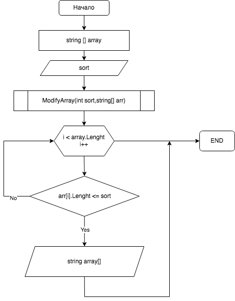

## Итоговая проверочная работа
### Данная работа необходима для проверки знаний и навыков по итогу прохождения первого блока обучения на программе разработчик.
## План работы:
* _Создать репозиторий на GitHub_
* _Нарисовать блок-схему алгоритма решения задачи_
* _Создать и заполнить README.md_
* _Написать программу по условию_
### Условие задачи:
Написать программу которая из имеющегося массива строк формирует массив из строк, 
длина которых меньше либо равна 3 символам. Первоначальный массив можно ввести с клавиатуры, либо задать на старте
выполнения алгоритма. При решении не рекомендуется пользоваться коллекциями, лучше обойтись исключительно массивами.
Пример:
* ["hello","2","world",":-)"] -> ["2",":-)"]
* ["1234","1567","-2","computer science"]->["-2"]
* ["Russia","Denmark","Kazan"]->[]

## **Блок-схема**

## Описание решения задачи
* _Инициализируем массив из строк_
* _Просим ввести число для сортировки элементов массива меньше или равным этому числу_
* _Запускаем метод модификации массива_
* _В методе запускаем цикл for в котором прописываем условие удовлетворяющее нашему заданию_
* _Выводим в терминал получившийся результат_

## Конец